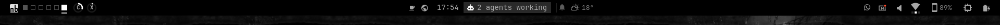
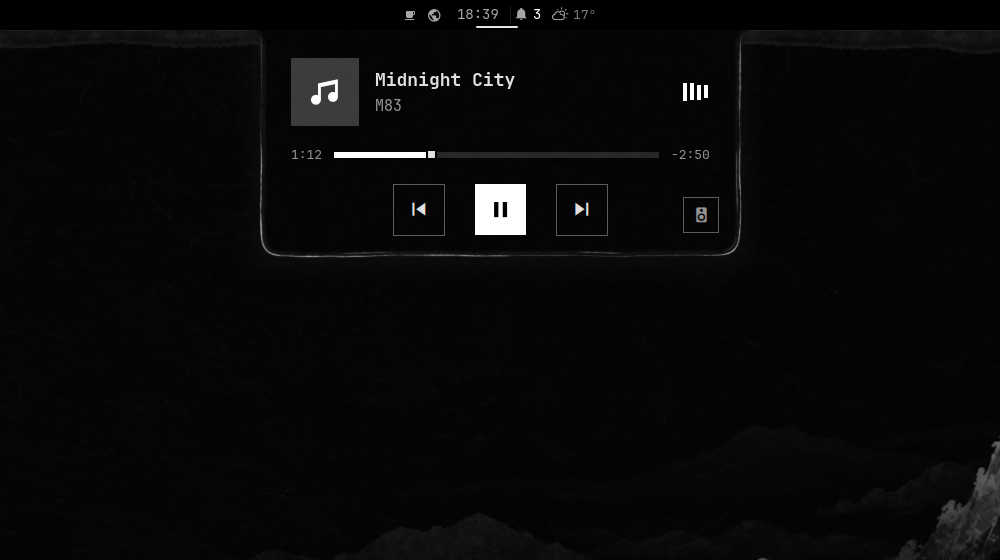

# Tusche Island for Omarchy

The clock in the middle of Omarchy's bar becomes an island. It grows a live segment for whatever is happening: agents, media, timers, meetings, AI limits, the phone. A click opens its popup, and notifications can run as a column under it. The island takes the theme's material, including the ink bloom and dried rim on the Tusche & Papier Lavur themes it is made for. It is the companion of the [Tusche Bar](https://github.com/nerdislb/omarchy-tusche-bar) and also works on its own.

Based on [Arjun010011/omarchy-dynamic-island](https://github.com/Arjun010011/omarchy-dynamic-island) (commit `9d6e3f4e072a77b7b11086934b785b6d7f2518f7`), MIT licence retained.




## Requirements

- **Omarchy:** a recent version with the Quickshell shell (the dev line of early October 2026 or later).
- **Tools:** `git`, `jq` and `rsync`.
- **Optional:** OmaMail (calendar), Flux (phone) and Omarchy's agents. The island shows these sources only when they are there.

## Install

The easiest way is the whole look, which places the island in the clock's spot for you:

```sh
git clone https://github.com/nerdislb/omarchy-tusche-bar.git ~/src/omarchy-tusche-bar
~/src/omarchy-tusche-bar/setup/install.sh
```

Only the island:

```sh
git clone https://github.com/nerdislb/omarchy-tusche-island.git ~/src/omarchy-tusche-island
cd ~/src/omarchy-tusche-island && ./dev-install.sh
omarchy-shell shell rescanPlugins
omarchy plugin enable nerdibeard.tusche-island center --before omarchy.clock
omarchy plugin disable omarchy.clock      # the island is the clock
```

**Update:** `git pull && ./dev-install.sh`, then `omarchy restart shell`.

**Remove:** `omarchy plugin disable nerdibeard.tusche-island`, then `omarchy plugin enable omarchy.clock center`.

## In the bar

The plugin is both a `panel` (state and sources) and a `bar-widget`. With `nerdibeard.tusche-island` in the bar (in the clock's place; make it `bar.centerAnchor`) the island lives there:

- At rest the widget is the clock (`format`, default `HH:mm`).
- Anything live grows a tinted segment beside the time: working agents, timer/stopwatch (with a progress rule), music, a meeting about to start, recording, mic/camera, an agent waiting for you; announcements (agent done, limits, track change, charging) take the segment for a few seconds.
- Left click opens the island as a **native bar popup** (Omarchy card, border, gap and outside-click/Esc dismissal; it closes when another bar popup opens). Right click opens the calendar, middle click plays/pauses.
- Without the widget in the bar (and with a `plugins[]` entry instead) the island floats under the bar as its own strip; `barMode: false` forces that.

While the plugin is in the bar, the shell reads and writes its entry in `bar.layout`, so keep only that one entry (no second one in `plugins[]`).

The look follows the running shell: Omarchy's popup colours and `BorderSurface` frame, the theme font, font scale and Reduced Motion.

## Notifications

With `notifications: true` the island takes over Omarchy's notification service (it disables `omarchy.notifications`, leaves a marker, and hands it back when the setting goes off or the plugin is removed). It keeps Omarchy's contract: the `notifications` IPC target (`dismissOne`, `dismissAll`, `invokeLast`, `showHistory`, `toggleDnd`, …), the DND state file and its exceptions (`omarchy-action` toasts and critical `notify-send`), `--exec` click commands, `replaces_id` updates in place.

In the bar, notifications roll out of the bar's bottom edge right under the island, as one column:

- **Normal**: exactly one open card (app name, summary, body, the sender's action buttons). Others wait under it as title rows (two, then `+N`) and move up when the open card leaves. Stand time 8 s (a sender's longer timeout up to 30 s), 5 s while others wait; the pointer on the column holds it. Click opens (default action / `--exec` / focus the app), right click or × dismisses, a waiting row clicked comes to the front.
- **Critical**: a requester (the sender's actions, **Later**, **Dismiss**) that pauses the open card until it is handled; Later puts it into the inbox.
- **Low** without buttons: no card, a still line in the island for a few seconds, then the inbox.
- **Bell** beside the clock: unread count; left click opens the inbox (Mark read, Clear all, do-not-disturb switch), right click toggles do not disturb.
- A 2 px line in the app's tone under the clock while a card hangs.

`noteStyle` sets the look without a theme material: `window` (a window head over Omarchy's card body, in the Omarchy frame) or `bubble` (a speech bubble whose notch flows out of the bar). With Omarchy's Reduced Motion cards fade instead of moving. Notifications appear on the focused monitor, under the island of that monitor's bar; the inbox and what is on screen survive a shell restart.

**Theme material.** With the Tusche Bar's `edge` option set to `theme` and a theme that ships `bar-material.json` (Tusche & Papier), notes and the island popup take the theme's card instead of `noteStyle`: the theme's frame with its hard ink shadow (Papier) or halo (Tusche), soft controls, no title bar; a critical note keeps its text in the theme's colours and carries one narrow signal stripe. On the Lavur themes (material `card.bloom`) notes bloom out of the bar instead, each its own sheet of wet paper (`views/InkSheet.qml`): ink fills it, the water clears it, and the pigment dries into a rim at its calm edge. The island follows theme switches.

**Failures.** A systemd unit (user or system) that fails, or a program that dumps core, is announced once as an ordinary notification in the urgent tone; a click opens the journal or the core dump details in a terminal. `failures: false` turns this off.

**Agent completions.** A working → idle transition after at least 20 seconds of work shows both the bar announcement and a normal notification popout. It uses the existing themed column, queue, hover pause and DND policy, without taking keyboard focus. Click to focus the agent (OpenClaw agents open the local Control UI). `agentDone: false` disables both completion announcements. Short status flickers and the initial agent snapshot remain silent; idle means the agent stopped working, not that its result passed verification.

## Desktop integration

The island shows what the rest of the desktop already knows instead of keeping its own copy. All links are **read-only**; nothing is written to or sent from them.

| Source | Shown as | Setting |
|---|---|---|
| OmaMail calendar cache `~/.cache/omamail/calendar-bar.json` (iCloud/CalDAV, same as the bar clock) | next meeting, month view, "starting now" toast | `omamail` |
| Flux daemon socket `$XDG_RUNTIME_DIR/flux/fluxd.sock` (`subscribe` only) | working herdr/OpenClaw agents as a live activity; "Done" toast and notification popout after ≥20 s of work; an agent waiting for you | `flux`, `agents`, `agentDone`, `attention` |
| Flux paired phone | battery in the opened island; one low-battery HUD per discharge | `phone` |
| Omarchy agent usage `~/.local/state/omarchy/agents/usage/<id>.json` | HUD when a limit crosses 90 %, reaches 100 % or resets; tightest limit in the opened island | `aiLimits`, `aiProviders` |

Extra `.ics` feeds work too (`calendars`, or **+** in the calendar view).

## Settings

Settings live in the island's entry in `~/.config/omarchy/shell.json` (in `bar.layout` while it is in the bar). The island writes the missing ones with their defaults, so values can be changed in place.

| Setting | Default | Meaning |
|---|---|---|
| `format` | `"HH:mm"` | the clock in the bar |
| `idle` | `"auto"` | resting island: `auto` only when it has something the bar does not show (agents, a meeting within 12 h, a limit ≥ 90 %, low battery, all-day events, DND), `pill` always, `hidden` never |
| `idleFace` | `"ticker"` | `ticker` (glances), `clock` or `none` |
| `notifications` | `false` | take over Omarchy's notifications (see above) |
| `noteStyle` | `"window"` | `window` or `bubble` (the former value `workbench` reads as `window`) |
| `inbox` | `true` | keep missed notifications in the inbox |
| `osd` | `false` | take over Omarchy's on-screen display (volume, brightness, … as island HUDs) |
| `volume`, `brightness` | `false` | HUDs for volume and brightness changes |
| `charging`, `trackChange`, `recording`, `mic`, `camera`, `bluetooth`, `calendar` | `true` | the matching activities and HUDs |
| `omamail`, `flux`, `agents`, `agentDone`, `phone`, `aiLimits` | `true` | desktop integration (see above) |
| `aiProviders` | `["claude", "codex", "antigravity"]` | usage files to read |
| `attention`, `failures` | `true` (not written) | an agent waiting for you; failed units and core dumps |
| `calendars` | `[]` | extra `.ics` links |
| `calendarLeadMinutes` | `15` | how early a meeting shows |
| `holidays` | `"off"` | `auto` (from the timezone) or a country code |
| `weekStart` | `"monday"` | first day in the month view |
| `timerSound` | `true` | a sound when the timer runs out |
| `mediaLingerSeconds` | `30` | how long paused music stays |
| `visualizerColor` | `"accent"` | `accent` or `artwork` |
| `textFont` | `"theme"` | a font family for words; `theme` uses the theme font |
| `barMode` | `true` | `false` forces the floating island |
| `monitor`, `layer`, `scale`, `topMargin`, `clockFormat`, `expandOnHover`, `reserveSpace`, `keybind` | `"primary"`, `"top"`, `1`, Omarchy's gap, `"HH:mm"`, `false`, `false`, `false` | the floating island: monitor (`focused` or a name), layer (`overlay`), size, gap under the bar, its clock, open on hover, keep a strip free (`keybind`, e.g. `"SUPER + ALT + I"`, toggles it) |

## IPC

Target `tusche-island`, e.g. `omarchy-shell tusche-island state`:

- `expand`, `collapse`, `toggle`, `calendar`, `show '<json>'`, `toast <title> <body> <icon> <color>`
- `set noteStyle window|bubble`, `set notifications true|false`
- `note open|dismiss|later|next|action:<id>` (the column's buttons, for keybinds), `markRead`
- `timer 25m [label]`, `timerToggle`, `timerCancel`, `stopwatch start|pause|toggle|reset`
- `activity <id> '<json>'`, `endActivity <id> [message]`, `activities` (live activities for scripts; see `UPSTREAM.md`)
- `addCalendar <link>`, `removeCalendar <link>`, `addCalendarFromClipboard`, `refreshCalendar`
- `reserveSpace on|off|toggle`, `state`, `ping`
- Previews: `demo media|paused|recording|mic|split|expanded|volume|brightness|charging|lowbattery|track|notification|inbox|timer|stopwatch|activity|calendar|calendar-view|camera|device|outputs|toast|off`, `noteDemo mail|chat|phone|low|critical|actions|burst|story|many`, `attentionDemo on|off`, `agentDoneDemo`, `failureDemo [unit]`, `flash`

## Develop

Run `./dev-install.sh` after every edit (it copies the working tree to `~/.config/omarchy/plugins/nerdibeard.tusche-island` and validates it; the shell hot-reloads it), and `node tests/model.cjs` for the model tests. `UPSTREAM.md` holds the original activity and scripting documentation; read its plugin ID and `dynamic-island` IPC target as `nerdibeard.tusche-island` and `tusche-island`. Its Apple styling and takeover defaults do not apply here.

## Licence

MIT (`LICENSE`), based on [omarchy-dynamic-island](https://github.com/Arjun010011/omarchy-dynamic-island) by Arjun010011 and contributors.
